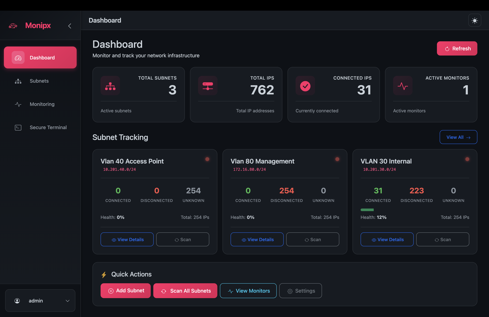

# Monipx

**A self-hosted IP address inventory and network monitoring tool**

[](LICENSE)
[](https://www.docker.com/)
[](https://nodejs.org/)

Monipx is an open-source, self-hosted monitoring tool designed to manage IP addresses within subnets and monitor network resources. It combines IP address inventory management with uptime monitoring capabilities, similar to Uptime Kuma.

---

## 📖 Project History

**Monipx** was born out of a real-world problem faced at **MwzConnect**. As a company managing multiple static subnets, it became increasingly difficult to track which IP addresses were connected and which were not. The challenge of maintaining an accurate IP inventory across different network segments led to the creation of this tool.

**Arnold Mwanza**, a passionate open-source developer and Lead Engineer at MwzConnect, decided to build Monipx to solve this problem. The project combines the best features of network monitoring tools like Uptime Kuma with specialized IP address inventory management, making it easier for network administrators and IT teams to track and monitor their network infrastructure.

This project is a testament to solving real problems with open-source solutions, built with modern technologies and a focus on user experience.

---

## 📸 Screenshot



*Monipx Dashboard showing real-time subnet monitoring, IP inventory, and network health statistics*

---

## ✨ Features

### 🎯 Multi-Subnet IP Address Management
- **Multiple Subnet Management**: Add and manage multiple subnets simultaneously
  - Support for different subnet sizes (`/24`, `/16`, `/8`, etc.)
  - Automatically lists all IPs in a subnet (e.g., 1-254 for `/24`)
  - Organize subnets by tags or categories
  - Per-subnet configuration and monitoring
- **Subnet Dashboard**: Unified view of all subnets with health indicators
- **Auto-discovery**: Automatically list all IP addresses in each subnet
- **Visual Status Indicators**: 
  - 🟢 Green = Connected
  - 🔴 Red = Not Connected
  - 🟡 Yellow = Unknown
- **Manual Override**: Manually change IP connection status
- **IP Inventory**: Complete inventory of all IPs across all subnets with details (hostname, domain, subdomain, MAC, last seen)
- **Domain/Hostname Support**: Associate domain, hostname, or subdomain with IP addresses
- **DNS Resolution**: Forward and reverse DNS lookup capabilities
- **Bulk Operations**: Scan, monitor, or configure multiple subnets at once

### 📊 Network Monitoring
- **Subnet Scanning**: Ping all IPs in a subnet to detect connected devices
- **Real-time Updates**: Live status updates via WebSocket
- **Multiple Monitor Types**:
  - ✅ Ping monitoring
  - ✅ HTTP/HTTPS monitoring with status code validation
  - ✅ TCP port monitoring
  - ✅ DNS resolution monitoring
  - ✅ WebSocket connection monitoring
- **Monitor Groups**: Organize monitors into collapsible groups
- **Subnet Health Tracking**: Health scores and trends per subnet
- **Uptime Statistics**: Track uptime percentage and availability
- **Response Time Tracking**: Monitor network performance with graphs
- **Configurable Intervals**: Set custom scan and monitoring intervals
- **Alert Thresholds**: Configure custom alert conditions
- **Status History**: Track monitor status changes over time
- **Charts & Graphs**: Beautiful visualizations with dark mode support

### 🔐 Secure SSH Terminal (NEW in v1.1.0)
- **Multi-Tab Terminal**: Open multiple SSH sessions in tabs with beautiful modern UI
- **Session Management**:
  - Save and organize SSH sessions by groups
  - Beautiful session sidebar with search functionality
  - Group management with expandable/collapsible groups
  - Session state persisted across page refreshes
- **SSH Key Authentication**:
  - Secure key-based authentication with AES-256-GCM encryption
  - Password authentication support with encrypted storage
  - Passphrase support for double encryption of SSH keys
- **Key Management**:
  - Upload existing SSH keys (RSA, ED25519, ECDSA)
  - Generate new SSH keys (RSA 2048/4096, ED25519)
  - Manage multiple keys with descriptions
  - Secure key storage with encryption
- **Real-time Terminal**:
  - Full xterm.js terminal with WebSocket communication
  - Multiple color schemes (Dracula, Monokai, Solarized Dark/Light, etc.)
  - Configurable terminal types (xterm-256color, xterm, vt100, etc.)
  - Copy/paste support
  - Scrollback buffer
- **Connection Features**:
  - Auto-reconnect on disconnect
  - Configurable keep-alive to prevent timeouts
  - Connection logging with timestamps and statistics
  - Session status indicators (connected, disconnected, error)
- **Security**:
  - All credentials encrypted at rest with AES-256-GCM
  - Secure WebSocket communication
  - No plaintext storage of passwords or keys
  - Environment-based encryption key management

### 🎨 Modern UI/UX
- **Beautiful Interface**: Built with Vue 3 and Bootstrap 5
- **Collapsible Sidebar**: Modern navigation menu that can collapse/expand with state persistence
- **Real-time Dashboard**: Live updates without page refresh via WebSocket
- **Responsive Design**: Works perfectly on desktop, tablet, and mobile
- **Dark Mode**: Full dark mode support with improved styling and contrast
- **Internationalization**: Support for multiple languages (English, French)
- **Modern Components**:
  - Beautiful session list with modern cards
  - Action buttons with hover effects
  - Search functionality across all views
  - Loading states and animations
  - Toast notifications for user feedback

---

## 🚀 Quick Start

### Docker Compose (Recommended)

```bash
# Clone the repository
git clone https://github.com/mwzconnect/monipx.git
cd monipx

# Generate a secure SSH encryption key (IMPORTANT for production!)
node -e "console.log(require('crypto').randomBytes(32).toString('hex'))"

# Set the SSH_ENCRYPTION_KEY environment variable
# Option 1: Create a .env file
echo "SSH_ENCRYPTION_KEY=your-generated-key-here" > .env

# Option 2: Export as environment variable
export SSH_ENCRYPTION_KEY=your-generated-key-here

# Start the application
docker-compose up -d --build

# View logs
docker-compose logs -f

# Stop the application
docker-compose down
```

Access Monipx at `http://localhost:3001`

On first launch, you'll be prompted to create an admin account.

**⚠️ IMPORTANT**: For production deployments, you **MUST** set a secure `SSH_ENCRYPTION_KEY` environment variable. This key is used to encrypt SSH private keys stored in the database. Without it, a default insecure key will be used.

### Docker Run (Recommended - Pull from GitHub Container Registry)

```bash
# Generate a secure encryption key first
export SSH_ENCRYPTION_KEY=$(node -e "console.log(require('crypto').randomBytes(32).toString('hex'))")

# Run Monipx container from GitHub Container Registry
docker run -d \
  --name monipx \
  --restart=unless-stopped \
  -p 3001:3001 \
  -v monipx-data:/app/data \
  -v monipx-logs:/app/logs \
  -e NODE_ENV=production \
  -e SSH_ENCRYPTION_KEY=$SSH_ENCRYPTION_KEY \
  ghcr.io/amwanza-mwz/monipx:latest

# Or use a specific version
docker run -d \
  --name monipx \
  --restart=unless-stopped \
  -p 3001:3001 \
  -v monipx-data:/app/data \
  -v monipx-logs:/app/logs \
  -e NODE_ENV=production \
  -e SSH_ENCRYPTION_KEY=$SSH_ENCRYPTION_KEY \
  ghcr.io/amwanza-mwz/monipx:v1.1.0
```

**Available on GitHub Container Registry**: [`ghcr.io/amwanza-mwz/monipx`](https://github.com/amwanza-mwz/Monipx/pkgs/container/monipx)

**Why GitHub Container Registry?**
- ✅ Free and unlimited for public repositories
- ✅ No rate limits
- ✅ Automatic builds with GitHub Actions
- ✅ Multi-architecture support (amd64, arm64)

### Non-Docker Installation

**Requirements:**
- Node.js >= 20.4
- npm or yarn
- Git

```bash
# Clone the repository
git clone https://github.com/mwzconnect/monipx.git
cd monipx

# Install dependencies
npm install

# Build frontend
npm run build

# Start server
npm start

# Or for development
npm run dev
```

---

## 📖 Documentation

For complete project documentation, see [PROJECT_SPECIFICATION.md](./PROJECT_SPECIFICATION.md)

The specification includes:
- Detailed feature list
- Technology stack
- Architecture design
- Database schema
- API documentation
- UI/UX specifications
- Development roadmap

---

## 🛠 Technology Stack

- **Frontend**: 
  - Vue.js 3 (Composition API)
  - Vite (Build tool)
  - Bootstrap 5 (UI framework)
  - Vue Router (Routing)
  - Pinia (State management)
  - Vue I18n (Internationalization)
  - Socket.io Client (Real-time updates)
  - Bootstrap Icons (Icons)

- **Backend**: 
  - Node.js 20+
  - Express.js (Web framework)
  - Socket.io (WebSocket server)
  - SQLite (Database)
  - Winston (Logging)

- **Containerization**: 
  - Docker
  - Docker Compose

---

## 🎯 Use Cases

1. **Network Administrators**: 
   - Track which IPs in static subnets are connected
   - Monitor network health across different locations
   - Manage IP inventory efficiently
   
2. **IT Teams**: 
   - Monitor websites and servers
   - Track subnet health and availability
   - Maintain accurate IP address inventory
   
3. **DevOps**: 
   - Real-time network health monitoring
   - Track infrastructure across different subnets
   - Monitor cloud and on-premise networks
   
4. **Small to Enterprise Businesses**: 
   - Simple IP address inventory management
   - Multi-location network monitoring
   - Centralized dashboard for all network resources

---

## 🗺 Roadmap

### ✅ Version 1.0 (Current)
- [x] Project specification and architecture
- [x] Basic infrastructure setup
- [x] Subnet management (CRUD operations)
- [x] IP inventory display (all IPs 1-254 for /24)
- [x] Subnet scanning (ping all IPs)
- [x] Manual IP status override
- [x] Domain/hostname/subdomain support
- [x] DNS resolution (forward/reverse)
- [x] Real-time updates via WebSocket
- [x] Dashboard with statistics
- [x] Beautiful UI with collapsible sidebar
- [x] Dark mode support
- [x] Internationalization (English, French)
- [x] Docker containerization
- [x] Admin user creation on first run

### ✅ Version 1.1.0 (Current)
- [x] Secure SSH Terminal with multi-tab support
- [x] SSH Session Management with groups
- [x] SSH Key Management (upload, generate, encrypt)
- [x] Real-time terminal with xterm.js
- [x] Password and key-based authentication
- [x] AES-256-GCM encryption for credentials
- [x] Connection logging and statistics
- [x] Multiple terminal color schemes
- [x] Session state persistence
- [x] Auto-reconnect and keep-alive
- [x] Beautiful modern UI for terminal
- [x] Search functionality for sessions
- [x] HTTP/HTTPS monitoring
- [x] TCP monitoring
- [x] DNS monitoring
- [x] WebSocket monitoring
- [x] Charts and graphs for monitoring
- [x] Monitor groups and organization

### 🔄 Version 1.2 (Planned)
- [ ] Notification system (email, webhook, Slack, Discord)
- [ ] Export functionality (CSV, JSON, PDF)
- [ ] Advanced alerting rules
- [ ] Status pages
- [ ] Multi-user support with roles
- [ ] API authentication with tokens

### 🚀 Future Versions
- [ ] Multi-user support with roles
- [ ] API authentication
- [ ] Plugin system
- [ ] Advanced reporting

See [TASKS_V1.md](./TASKS_V1.md) for detailed task breakdown.

---

## 🤝 Contributing

Monipx is an open-source project. Contributions are welcome!

1. Fork the repository
2. Create a feature branch (`git checkout -b feature/amazing-feature`)
3. Commit your changes (`git commit -m 'Add some amazing feature'`)
4. Push to the branch (`git push origin feature/amazing-feature`)
5. Open a Pull Request

---

## 📝 License

This project is licensed under the MIT License - see the [LICENSE](LICENSE) file for details.

---

## 🙏 Acknowledgments

- Inspired by [Uptime Kuma](https://github.com/louislam/uptime-kuma) by Louis Lam
- Built with modern web technologies
- Thanks to all contributors and the open-source community

---

## 👤 Author

**Arnold Mwanza**

- Lead Engineer at MwzConnect
- Passionate about open-source development
- GitHub: [@mwzconnect](https://github.com/mwzconnect)

**Organization:** [MwzConnect](https://github.com/mwzconnect)

---

## ⭐ Star History

If you find Monipx useful, please consider giving it a ⭐ on GitHub!

---

## 📧 Support

For issues, questions, or contributions, please open an issue on GitHub.

---

**Status**: ✅ Active Development | 🚀 Ready for Production Use

**Version**: 1.1.0

---

*Built with ❤️ by Arnold Mwanza for the open-source community*
